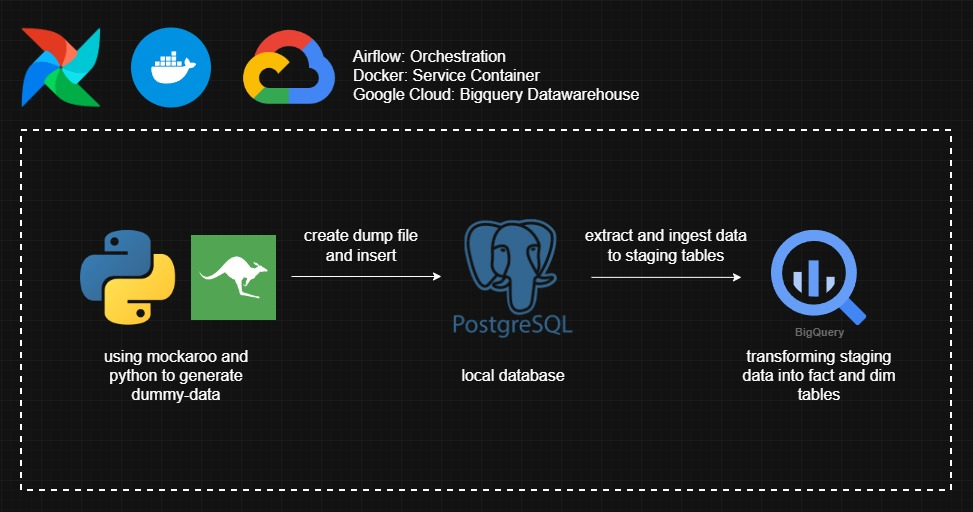
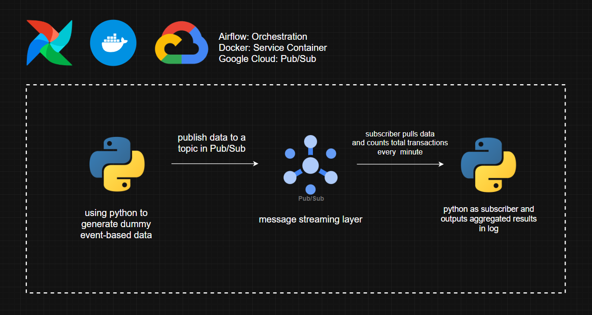
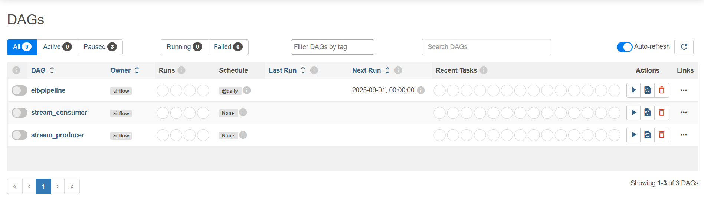
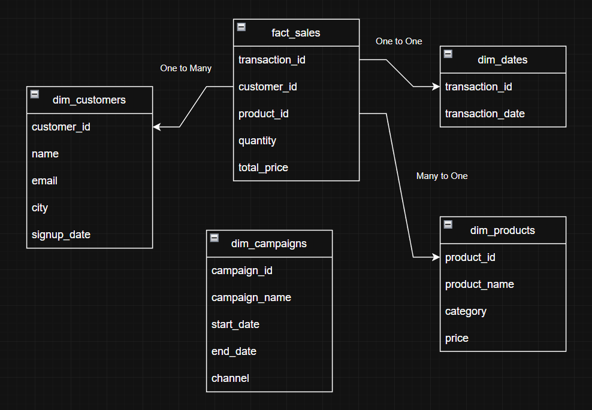

# Datalabs Data Engineering Technical Test
### Batch


### Streaming


## Overview

This project was developed as Technical Test for the Data Engineering Position at datalabs.id. It demonstrates the design and implementation of an end-to-end data pipeline, focusing on data ingestion, transformation, and warehouse modeling using modern data engineering tools.

The pipeline simulates a real-world scenario where transactional data is generated, processed, and analyzed through various stages, from raw data ingestion to a dimensional data warehouse structure.

The project is divided into three core tasks and one Additional task:
- **Extracting data** from a local **PostgreSQL database**.
- **Ingesting/Loading data** to **Google Bigquery** as data warehouse for further data transformation.
- **Transforming data** into a star schema consisting of **fact and dimension tables**.
- **Additional - Stream** event-based data to **Google Cloud Pub/Sub** for real-time processing.

## Tools

### **Docker** – Containerized services such as Airflow and PostgreSQL.

There are two separate Docker Compose files created in this project, as described below:

 1. **`airflow`** - Handles the orchestration and scheduling of data pipelines.
 2. **`postgres`** - Acts as the local database for data extraction.

 Both services are built separately to simulate a real-world scenario where each tool runs on a different machine or environment. They are connected through a **Docker Networks** named **`maindb_network`**, which enables communication between the containers.
 Since the network is hosted by the PostgreSQL service, it must be started **before** the Airflow service.

To launch all Docker Compose services at once, go to the project directory and execute these commands in the given order:
 ```bash
docker compose -f postgres/docker-compose.yaml up -d
docker compose -f airflow/docker-compose.yaml up -d
```

To stop and remove all running Docker Compose services, navigate to the project directory and execute the following command:
 ```bash
docker compose -f airflow/docker-compose.yaml down
docker compose -f postgres/docker-compose.yaml down
```

### **Apache Airflow** – Workflow orchestration for automated data pipelines.

Once all Docker services are up and running, you can access the **Airflow Webserver** through your web browser at **`localhost:8080`**.

When prompted for credentials, use the username and password defined in the **Airflow** **`docker-compose.yaml`** file.
By default, they are set as:

- Username: **`airflow`**
- Password: **`airflow`**

After logging in, you’ll land on the **Airflow Dashboard**, where you can see all available **DAGs** ready to be executed, as shown below:



To **run a DAG**, you can either:
- Click the **“Run”** button in the **Action** column (on the right side), or
- Toggle the **switch button** to the left of the DAG name.
Similarly, to **pause or stop** a DAG, simply click the **same toggle** button on the left side of its name.

You can **monitor DAGs** by clicking on a DAG name and selecting a specific **run instance** to view detailed logs and task progress.

### **PostgreSQL** – Local database used as the data source.

Dummy datasets were created as part of the Technical Test requirements, consisting of **customers**, **products**, **transactions**, **transaction_items**, and **marketing_campaigns** tables.
The data was generated using Mockaroo
 and a custom **Python data generator** to simulate a real-world supermarket use case.

A **`dump-supermarket.sql`** file was created to automatically populate the database with sample data each time the PostgreSQL container is started through Docker Compose.

The data pipeline built for this project simulates the process of **ingesting data from an OLTP database (PostgreSQL)** which handles real-time transactions into an **OLAP database (BigQuery)** designed for analytical workloads.

The ingestion workflow consists of three main steps:
1. *Extract* data from PostgreSQL and store it temporarily as a CSV file.
2. **Check or create** the corresponding dataset in BigQuery.
3. **Load** the data from the temporary file into **staging tables** in BigQuery.

Finally, the pipeline performs **UPSERT** operations (**using BigQuery MERGE queries**) to load data into the production **tables**, ensuring no duplicate records exist in the analytical layer.

### **Google BigQuery** – Cloud data warehouse for transformed and analytical-ready data.

Once the data is successfully ingested from PostgreSQL into the **staging tables** in BigQuery, the next step is the **transformation process**.
This step converts raw transactional data into **a dimensional model (Star Schema)** a structure designed to optimize analytical queries and reporting performance.

The transformation process creates one **fact table** and several **dimension tables**, as follows:
- fact_sales
- dim_customers
- dim_products
- dim_dates
- dim_campaigns

Below is the **Entity Relationship Diagram (ERD)** that illustrates the relationship between the fact and dimension tables:



I chose this model to focus the analytical process around the **`fact_sales`** table, which serves as the central **fact table** containing the main transactional data derived from the staging tables **`transactions`** and **`transaction_items`**.
The selected columns represent key quantitative and relational attributes that support sales performance analysis:

**`transaction_id`** – Serves as a unique identifier for each transaction and links to the date dimension (**`dim_dates`**).

**`customer_id`** – Connects each transaction to customer information in **`dim_customers`**, enabling behavioral and segmentation analysis.

**`product_id`** – Links transactions to product details in **`dim_products`**, supporting product-level performance analysis.

**`quantity`** – Indicates the number of products purchased in each transaction, representing sales volume.

**`total_price`** – Represents the total transaction value (quantity × price), used for revenue and financial performance metrics.

The dimension tables (**`dim_customers`**, **`dim_products`**, **`dim_dates`**, and **`dim_campaigns`**) act as **supporting structures** that provide additional descriptive context for analytical purposes, allowing flexible exploration of sales data by customer, product, time, and campaign dimensions.

### **Google Pub/Sub** – Cloud-based messaging service for real-time data streaming and event-driven communication.

This additional task demonstrates a **real-time data streaming pipeline** using **Google Pub/Sub** and **Python**.
It simulates how event-driven data can be ingested, processed, and aggregated continuously outside the batch ETL flow.

**Workflow Overview**

1. **Python Producer** generates **dummy event-based data** (simulating transaction events).
2. These events are **published** to a **Pub/Sub topic** in **real time**.
3. **Pub/Sub** acts as the message streaming layer, ensuring reliable delivery of event data.
4. **A Python Subscriber** listens to the subscribed topic, **pulls messages**, and performs a 1-minute aggregation to count the total number of transactions received within that window.
5. The aggregated result is then **logged**.